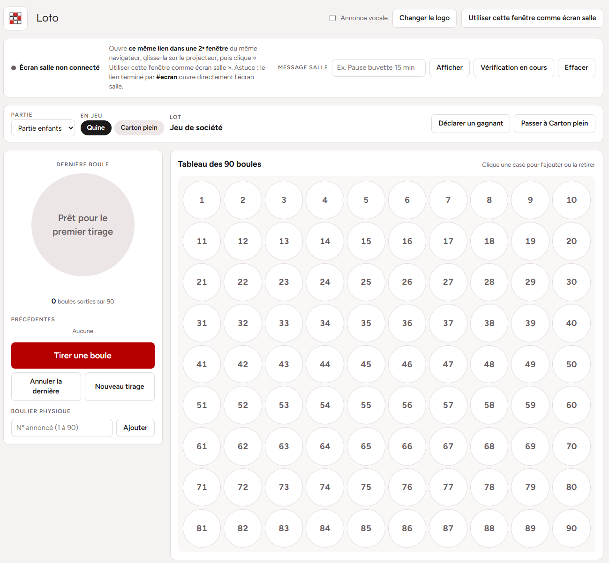

# Tableau de bord pour Loto facile

Un tableau de bord simple pour animer un loto associatif : tirage des boules, suivi des parties et des lots, vérification des cartons et affichage grand écran pour la salle.

Tout tient dans un fichier HTML accompagné de son logo : pas d'installation, pas de serveur, pas de compte. On l'ouvre dans un navigateur et c'est parti.



## Démarrage

1. Ouvrir `Dashboard_Loto.html` dans un navigateur récent (Chrome, Edge, Firefox).
2. Renseigner le nom de l'événement en haut de la page.
3. Préparer les parties et les lots dans l'onglet **Parties et lots** (à la main ou par import CSV).
4. Lancer le tirage.

Une connexion Internet n'est utile que pour charger les polices ; la page fonctionne sans.

## Fonctionnalités

### Régie (écran de l'animateur)

- **Tirage** : bouton « Tirer une boule » (ou touche **Espace**), annulation de la dernière boule, remise à zéro.
- **Boulier physique** : saisie du numéro annoncé si les boules sont tirées dans un vrai boulier.
- **Tableau des 90 boules** : un clic sur une case ajoute ou retire le numéro.
- **Annonce vocale** des numéros (synthèse vocale du navigateur, désactivable).
- **Partie en cours** : choix de la partie, étape en jeu (quine, double quine, carton plein), lot à gagner et lot suivant.
- **Déclarer un gagnant** puis passer à la phase suivante ; l'historique est visible dans l'onglet **Gagnants**.
- **Vérifier un carton** : saisie des 15 numéros du carton annoncé, les numéros sortis passent au vert et le verdict s'affiche.
- **Message salle** : afficher un bandeau sur l'écran de la salle (« Pause buvette 15 min », « Vérification en cours »…).
- **Logo personnalisé** : « Changer le logo » remplace le logo de la régie et de l'écran salle par une image de son choix (PNG, JPG, SVG…) ; « Logo d'origine » revient au logo par défaut (`logo.png`). Le logo choisi est mémorisé dans le navigateur.

### Écran salle (projecteur / TV)

Affichage plein écran lisible au fond de la salle : boule géante, dernières boules, tableau des 90 numéros, partie et lot en jeu.

1. Ouvrir **le même fichier dans une 2ᵉ fenêtre** du même navigateur.
2. Glisser cette fenêtre sur le projecteur ou la TV.
3. Cliquer sur « Utiliser cette fenêtre comme écran salle » (ou ouvrir directement le lien terminé par `#ecran`).
4. Passer en plein écran.

L'écran salle suit la régie automatiquement. L'indicateur « Écran salle connecté » confirme la liaison.

## Fichier des lots (CSV)

Les lots peuvent être préparés dans Excel puis importés. Une ligne par lot, trois colonnes séparées par des points-virgules :

```csv
Partie;Étape;Lot
Partie 1;Quine;Coffret shampoing
Partie 1;Double quine;Panier garni
Partie 1;Carton plein;Raquette de badminton
```

- **Étape** : `Quine`, `Double quine` ou `Carton plein`.
- Une étape peut contenir plusieurs lots : le gagnant de l'étape les remporte tous.
- Enregistrer en CSV (séparateur point-virgule), puis importer le fichier ou le glisser dans le cadre prévu.

Un exemple complet est fourni : [modele-lots-loto.csv](modele-lots-loto.csv). La page permet aussi de télécharger ce modèle et d'exporter les lots actuels.

## Sauvegarde

L'état du loto (parties, boules tirées, gagnants) est enregistré automatiquement dans le navigateur (`localStorage`). Fermer ou recharger la page ne perd rien, à condition de rouvrir le fichier dans le même navigateur.

## Contenu du dépôt

| Fichier | Rôle |
| --- | --- |
| `Dashboard_Loto.html` | L'application complète (HTML, CSS et JavaScript intégrés) |
| `logo.png` | Logo par défaut, à garder dans le même dossier que la page (le remplacer change le logo par défaut) |
| `modele-lots-loto.csv` | Modèle de fichier de lots à importer |
| `screenshot.png` | Capture d'écran de la régie utilisée dans ce README |
